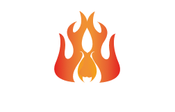

 
<h1>
 Restaurant Asado de la Montaña
</h1>

Created free of charge for learning of those involved and support for a local business in El Salvador.

    <a href="#" target="_blank">
        Preview
    </a>
    &nbsp;✦&nbsp;
    <a href="#-getting-started">
        Getting Started
    </a>
    &nbsp;✦&nbsp;
    <a href="#-commands">
        Commands
    </a>
    &nbsp;✦&nbsp;
    <a href="#-license">
        License
    </a>

## 🛠️ Stack

- [**React**](https://es.react.dev/) - The library for web and native user interfaces.
- [**Typescript**](https://www.typescriptlang.org/) - JavaScript with syntax for types.
- [**Material UI**](https://tailwindcss.com/) - A utility-first CSS framework for rapidly building custom designs.
- [**tailwindcss-animated**](https://github.com/new-data-services/tailwindcss-animated) - Extended animation utilities for Tailwind CSS.
- [**fontsource**](https://fontsource.org/) - Self-host Open Source fonts in neatly bundled NPM packages.

